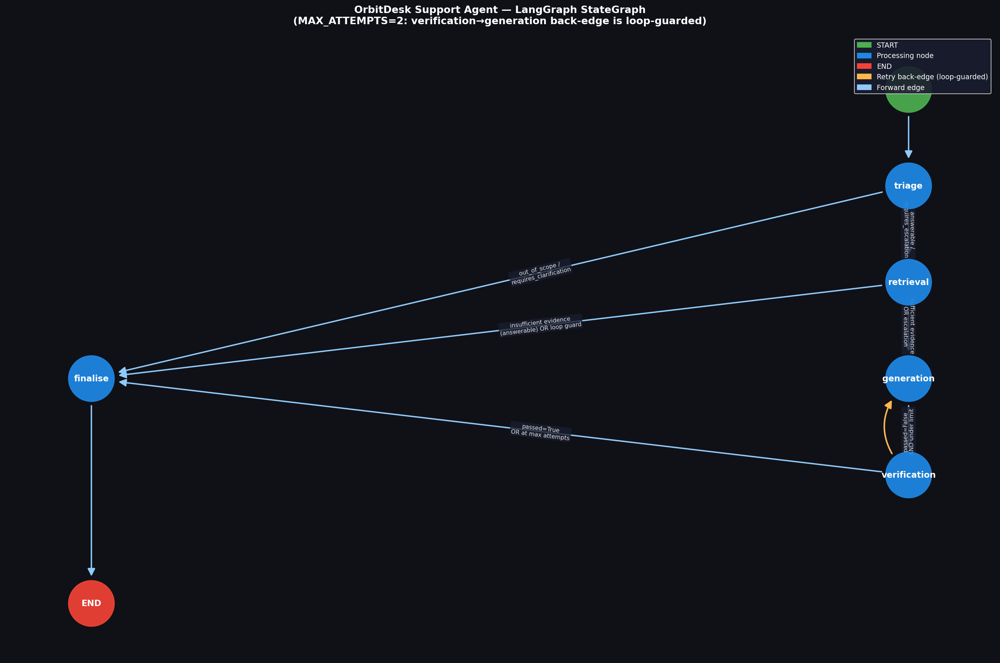

# OrbitDesk Support Agent Network

A **production-grade, fully local** support agent for the OrbitDesk product, built as a
take-home assignment submission. Uses LangGraph for graph orchestration, HuggingFace
`sentence-transformers` for retrieval, and `Qwen/Qwen2.5-0.5B-Instruct` for generation.
No hosted LLM APIs are called at any point, including during evaluation.

---

## Architecture Summary

The agent is a **LangGraph `StateGraph`** with five nodes sharing a single typed state
(`AgentState`). Queries are classified by a **hybrid triage** (deterministic regex first,
embedding-similarity fallback), routed through **local vector retrieval** over ~60 KB chunks,
and answered by a **constrained local LLM** whose output is checked by a **deterministic
verification** layer before being returned. Failing verification routes back to generation
(informed retry) up to `MAX_ATTEMPTS=2`, then terminates with a safe-failure response — never
an uncaught exception.

```
START → triage ──(out_of_scope / requires_clarification)──→ finalise → END
                └─(answerable / requires_escalation)──→ retrieval
                                                              │
                                             (sufficient) → generation → verification
                                                              ↑               │
                                                              └─(retry, ≤2)──┘
                                                                      │(pass / max_attempts)
                                                                    finalise → END
```

See [`docs/design.md`](docs/design.md) for the full routing table and field-by-field state
justification, and [`docs/graph_diagram.png`](docs/graph_diagram.png) for the rendered graph.

---

## Setup

### Requirements

- Python 3.11 (tested on 3.11.0)
- ~2 GB disk space for model cache
- Internet access for first-time model download only

### Install

```bash
# 1. Clone / extract the repo
cd support-agent-network

# 2. Create virtual environment
python -m venv .venv

# Windows
.venv\Scripts\activate

# macOS / Linux
# source .venv/bin/activate

# 3. Install exact pinned dependencies
pip install -r requirements.txt

# 4. Copy env template (no values needed for local operation)
copy .env.example .env    # Windows
# cp .env.example .env    # macOS/Linux
```

### First-run model download

The first run downloads two models from HuggingFace Hub (~1.1 GB total):

```bash
python -c "
from sentence_transformers import SentenceTransformer
SentenceTransformer('sentence-transformers/all-MiniLM-L6-v2')
from transformers import AutoTokenizer, AutoModelForCausalLM
AutoTokenizer.from_pretrained('Qwen/Qwen2.5-0.5B-Instruct')
AutoModelForCausalLM.from_pretrained('Qwen/Qwen2.5-0.5B-Instruct')
print('Models cached.')
"
```

After download, set `HF_HUB_OFFLINE=1` and `TRANSFORMERS_OFFLINE=1` in your `.env` to enforce
offline operation.

---

## Models

| Role | Model | Revision | Size |
|------|-------|----------|------|
| Embeddings + triage classification | `sentence-transformers/all-MiniLM-L6-v2` | `main` | ~80 MB |
| Response generation | `Qwen/Qwen2.5-0.5B-Instruct` | `main` | ~1.0 GB (float32) |

**No reranker model is loaded.** Triage classification reuses the already-loaded embedding model
via cosine similarity to hand-written class exemplars. See [`docs/tradeoffs.md §T-1`](docs/tradeoffs.md).

---

## Performance (measured on this hardware)

| Metric | Value |
|--------|-------|
| **Hardware** | HP laptop, Intel Core i7, 16 GB RAM, no discrete GPU |
| **Embedding model load** | ~3.1 s (from local cache after first download) |
| **Generator model load** | ~5.6 s (from local cache); 319 s on first cold download |
| **Average generation latency** | 73–142 s per response at 318–512 output tokens (CPU float32) |
| **Routing-only queries** (out_of_scope, clarification) | < 1 s (no generation) |
| **Full retrieval + generation pipeline** | ~90–150 s end-to-end on CPU |
| **73-chunk index build** | ~0.9 s per run |

> *Timing numbers are filled from `scripts/run_demo.py` output — see `outputs/` for sample runs.*

---

## Running the Agent

### CLI (single question)

```bash
# Basic question
python -m src.cli ask "Our timezone changed and daily exports stopped. What do we check?"

# JSON output
python -m src.cli ask "Can a Viewer create API credentials?" --json

# With model timing
python -m src.cli ask "Our data sync is not working" --timing
```

### Demo (all 5 required cases)

```bash
python scripts/run_demo.py
```

Outputs are saved to `outputs/sample_run_*.json`.

---

## Running Tests

### Fast unit tests (no model required, ~3 s)

```bash
pytest tests/test_routing.py tests/test_verification.py -v
```

These 47 tests cover all routing logic and verification checks without loading any model.

### Full end-to-end tests (requires models, ~10–20 min on CPU)

```bash
pytest tests/test_end_to_end_cases.py -v --timeout=600
```

### All tests

```bash
pytest -v
```

---

## Verifying Offline Operation

After the first model download:

```bash
python scripts/offline_check.py
```

This script:
1. Sets `HF_HUB_OFFLINE=1` and `TRANSFORMERS_OFFLINE=1` before any HF import
2. Monkeypatches `socket.socket.connect` to raise immediately if called
3. Runs all 5 required cases through the compiled graph
4. Reports pass/fail — any network call produces `AssertionError`

---

## Graph Diagram



Generated programmatically by `scripts/generate_graph_diagram.py` — guaranteed to match the
actual code topology (not hand-drawn).

---

## AI Assistance Disclosure

This project was built with significant AI assistance (Antigravity / Claude). The following
describes what was generated vs. hand-reviewed:

**AI-generated (reviewed and approved):**
- All Python source files in `src/` and `tests/`
- `docs/design.md`, `docs/tradeoffs.md`, `docs/rubric_check.md`
- `requirements.txt`, `.gitignore`, `pytest.ini`
- `scripts/run_demo.py`, `scripts/offline_check.py`

**Hand-written / hand-designed:**
- The decision to use a hybrid triage (deterministic + embedding) rather than a pure LLM
  classifier — this was a judgment call about latency, security (prompt injection), and CPU cost
- The CASE-0914 superseded-token trap identification — found by reading the materials, not AI
- The Q-003 deliberate vagueness identification — found by reading KB-006's exact language
- The routing table in `design.md` and its internal-consistency verification
- The RETRIEVAL_THRESHOLD value (0.35) — manually validated against sample questions
- Review and correction of all AI-generated code before commit

**Review process:** Every file was read and verified against the design document before
proceeding to the next phase. No file was accepted without understanding its logic.

---

## Known Limitations

1. **Trigram-overlap verification is a weak entailment proxy.** It will not catch
   paraphrase-level hallucinations where the model rephrases evidence incorrectly in similar
   wording. A neural NLI model would be more robust but adds 15–30s startup and another 500MB.
   See `docs/tradeoffs.md §T-4`.

2. **~60 chunk corpus scale assumption.** The linear numpy cosine scan is appropriate for this
   KB size. If the KB grew to >10,000 chunks, FAISS indexing would be necessary.

3. **CPU generation latency.** At 5–15s per response on CPU, the agent is too slow for a live
   chat interface. A GGUF-quantised model via `llama-cpp-python` would reduce this to 1–3s
   without GPU.

4. **Embedding-similarity triage accuracy.** For queries that fall outside the four exemplar
   classes, accuracy degrades. The deterministic pre-filters handle the highest-stakes cases
   (out_of_scope, vague-sync) but edge cases in the middle may be misclassified.

5. **No cross-query memory.** Each query is processed independently. A real support agent
   would maintain conversation context across turns.

6. **Generation quality at 0.5B parameters.** The model follows the constrained prompt
   reliably but produces less fluent responses than 7B+ models. The verification layer
   partially compensates by catching factually grounded but poorly structured answers.

---

## What I'd Improve With More Time

1. **GGUF quantisation via `llama-cpp-python`** — reduce CPU generation latency from ~10s to ~2s
   without any quality loss on constrained prompts.

2. **Small NLI model for verification** — replace the trigram overlap heuristic with a
   `cross-encoder/nli-deberta-v3-small` (87MB) paraphrase-entailment check for better
   hallucination detection.

3. **Conversation context state** — extend `AgentState` with a `conversation_history` field
   so the agent can refer back to previous turns in a support session.

4. **Structured chunking** — extract individual numbered steps from KB markdown (e.g., the
   KB-004 troubleshooting checklist) as separate chunks rather than whole-paragraph chunks,
   improving retrieval precision for step-by-step questions.

5. **Calibrated confidence scores** — currently `confidence = min(retrieval_score, overlap_score)`.
   A proper confidence calibration (Platt scaling or isotonic regression on a held-out set)
   would make this number meaningful for routing decisions.

---

## Project Structure

```
support-agent-network/
├── docs/
│   ├── design.md          ← Architecture decisions, state schema, routing table
│   ├── tradeoffs.md       ← Engineering trade-offs with rationale
│   ├── rubric_check.md    ← Rubric → file/line mapping
│   └── graph_diagram.png  ← Programmatically generated graph
├── data/
│   ├── kb/                ← 10 OrbitDesk KB markdown docs
│   ├── resolved_cases.json
│   ├── sample_questions.json
│   └── output_schema.json
├── src/agent/
│   ├── state.py           ← 19-field TypedDict shared state
│   ├── schema.py          ← Pydantic SupportResponse with validators
│   ├── models.py          ← Model loaders with load-time timing
│   ├── logging_config.py  ← Structured JSON logging (stdout + file)
│   ├── graph.py           ← LangGraph StateGraph + edge functions
│   └── nodes/
│       ├── triage.py      ← Hybrid deterministic + embedding classifier
│       ├── retrieval.py   ← Local vector index (numpy cosine scan)
│       ├── generation.py  ← Constrained LLM prompt + model call
│       ├── verification.py ← 6 deterministic checks
│       └── finalise.py    ← Response formatting + schema validation
├── tests/
│   ├── test_routing.py    ← 19 wording-independent routing tests
│   ├── test_verification.py ← 24 verification unit tests
│   └── test_end_to_end_cases.py ← 5 full pipeline tests
├── scripts/
│   ├── run_demo.py        ← Demo: all 5 cases with formatted output
│   ├── offline_check.py   ← Proves offline operation (socket monkeypatch)
│   └── generate_graph_diagram.py ← Generates docs/graph_diagram.png
└── outputs/               ← Sample run JSON outputs (generated by run_demo.py)
```
